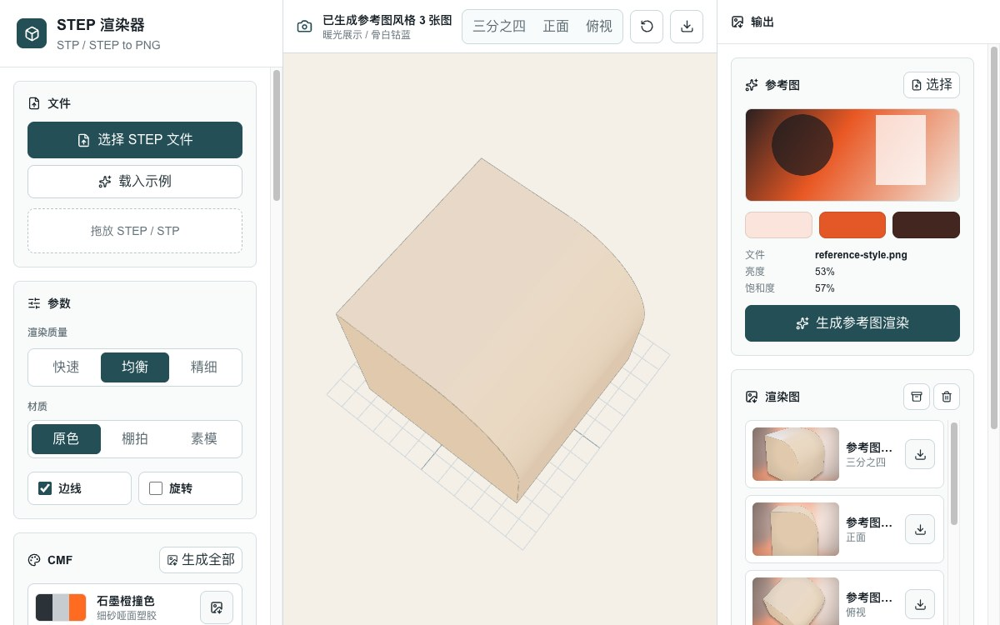

# STEP CMF Render Studio

## English Overview

STEP CMF Render Studio is a browser-based product-rendering workstation for STEP/STP models. It lets users inspect CAD geometry, experiment with color, material, and finish (CMF) choices, adjust lighting, and export presentation-ready images without installing a desktop CAD package.

The workspace provides fast, balanced, and fine geometry-processing presets; original, studio, and clay material modes; reusable CMF palettes and material presets; white-background, high-contrast, and warm-light environments; reference-image color and style extraction; multiple camera viewpoints; and single PNG or batch ZIP export. STEP parsing runs in a Web Worker using OpenCascade, while Three.js handles the interactive renderer.

The application is built with Next.js 16, React 19, TypeScript, Vinext, Vite, Cloudflare Workers, Three.js, `occt-import-js`, and Tailwind CSS. Node.js 22.13 or newer is required. Run `npm install` followed by `npm run dev` for local development, or `npm run build` for a production build.

一个运行在浏览器中的 STEP/STP 产品渲染工作台。无需安装桌面 CAD 软件，即可载入三维模型、调整材质与灯光，并导出适合评审或展示的产品渲染图。



## 功能

- 在浏览器中解析并预览 STEP/STP 模型
- 提供快速、均衡、精细三档几何解析质量
- 切换源材质、棚拍材质与白模效果
- 应用 CMF 配色模板和材质预设
- 选择白底电商、黑底高反差、暖光展示等渲染环境
- 根据参考图提取配色与视觉风格
- 生成三分之四、正面、俯视等视角图片
- 导出单张 PNG 或批量 ZIP

## 技术栈

- Next.js 16、React 19、TypeScript
- vinext、Vite、Cloudflare Workers
- Three.js、occt-import-js、Web Workers
- Tailwind CSS

## 本地运行

需要 Node.js `>=22.13.0`。

```bash
npm install
npm run dev
```

生产构建：

```bash
npm run build
```

## 项目结构

- `app/StepRenderer.tsx`：文件载入、交互和渲染工作台
- `app/materialSystem.ts`：材质预设与材质创建逻辑
- `app/cmfTemplates.ts`：CMF 配色模板
- `public/step-worker.js`：浏览器端 STEP/STP 解析 Worker
- `.openai/hosting.json`：OpenAI Workspace Sites 托管配置

## 数据库（可选）

项目已预留 Cloudflare D1 与 Drizzle 支持，但当前核心渲染流程不依赖数据库。修改 `db/schema.ts` 后可运行：

```bash
npm run db:generate
```
